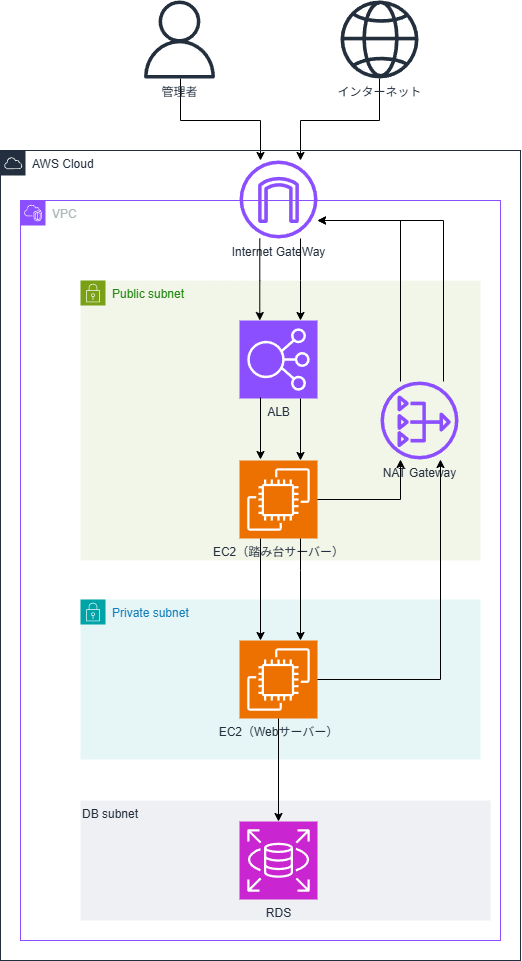

# AWS プライベートサブネット構成 + PHP Webアプリ

## 概要

AWSのプライベートサブネット構成をTerraformでIaC化し、PHP + MySQL を使ったWebアプリケーションを構築したプロジェクトです。
ブラウザからフォームに入力したデータをRDS（MySQL）に保存・表示する動的Webアプリを、`terraform apply` 1回で全自動構築できます。

---

## 構成図



---

## 使用技術

### AWS
- VPC・サブネット（パブリック/プライベート/DB）
- EC2（踏み台サーバー・Webサーバー）
- ALB（Application Load Balancer）
- RDS（MySQL 8.0）
- NAT Gateway
- Internet Gateway
- Security Group

### IaC
- Terraform

### Webサーバー
- Nginx 1.30
- PHP 8.5 + PHP-FPM
- MariaDB クライアント（MySQL接続用）

### アプリケーション
- PHP（PDO・プリペアドステートメント）
- MySQL
- CSS

---

## インフラ構成の詳細

### ネットワーク設計

| リソース | CIDR / 配置 |
|---|---|
| VPC | 10.0.0.0/16 |
| パブリックサブネット 1a | 10.0.1.0/24 |
| パブリックサブネット 1c | 10.0.2.0/24 |
| プライベートサブネット 1a | 10.0.10.0/24 |
| プライベートサブネット 1c | 10.0.20.0/24 |
| DBサブネット 1a | 10.0.30.0/24 |
| DBサブネット 1c | 10.0.40.0/24 |

### セキュリティグループ設計

| SG名 | インバウンドルール |
|---|---|
| ALB用 | HTTP(80)・HTTPS(443) from 0.0.0.0/0 |
| 踏み台EC2用 | SSH(22) from 自分のIPのみ |
| WebサーバーEC2用 | HTTP(80) from ALB SG・SSH(22) from 踏み台 SG |
| RDS用 | MySQL(3306) from WebサーバーEC2 SG |

---

## terraform apply で自動化される内容

```
① VPC・サブネット・IGW・NAT Gateway作成
② セキュリティグループ作成
③ 踏み台EC2作成・秘密鍵自動転送
④ WebサーバーEC2作成
   → Nginx インストール・起動
   → PHP 8.5 インストール・起動
   → Nginx設定ファイル自動書き換え（PHP-FPM連携）
   → index.php 自動配置（RDSエンドポイント動的埋め込み）
   → style.css 自動配置
⑤ ALB作成・ターゲットグループ・リスナー設定
⑥ RDS MySQL 8.0 作成
⑦ usersテーブル自動作成（踏み台EC2経由）
```

---

## ファイル構成

```
saito-aws-private-subnet/
├── main.tf           → プロバイダー設定
├── variables.tf      → 変数定義
├── network.tf        → ネットワークリソース
├── security_group.tf → セキュリティグループ
├── ec2.tf            → EC2・秘密鍵自動転送
├── alb.tf            → ALB関連リソース
├── rds.tf            → RDS・テーブル自動作成
├── outputs.tf        → 出力値
├── terraform.tfvars  → 機密情報（.gitignoreで除外）
└── templates/
    ├── userdata.sh      → EC2起動時スクリプト
    ├── nginx.conf.tpl   → Nginx設定テンプレート
    ├── index.php.tpl    → PHPアプリテンプレート
    └── style.css        → CSSスタイルシート
```

---

## セットアップ手順

### 前提条件

- AWSアカウントが作成済みであること
- Terraform がインストール済みであること
- AWS CLI がインストール済みであること
- AWS SSO の設定が完了していること（profile: myprofile）
- EC2キーペア（my-keypair）が作成済みであること

### 手順

**1. リポジトリをクローンする**

```bash
git clone https://github.com/albastru0227/saito-aws-private-subnet.git
cd saito-aws-private-subnet
```

**2. terraform.tfvars を作成する**

```hcl
ip_address_ssh = "自分のIPアドレス/32"
db_password    = "任意のパスワード"
```

**3. AWSにログインする**

```bash
aws sso login --profile myprofile
```

**4. Terraformを初期化する**

```bash
terraform init
```

**5. インフラを構築する**

```bash
terraform apply -auto-approve
```

**6. ブラウザでアクセスする**

`outputs` に表示される `alb_dns` のURLにアクセスする。

```
http://<alb_dns>
```

**7. リソースを削除する**

```bash
terraform destroy
```

---

## Webアプリの機能

- ユーザー登録フォーム（名前・メールアドレス入力）
- PDO + プリペアドステートメントでRDS MySQLに保存
- 登録済みデータをテーブル形式で一覧表示
- PRGパターン実装（リロード時の重複登録防止）
- CSSによるUI改善

---

## 学んだこと

### Terraform

- **`templatefile()` によるファイル分離**
  当初は `user_data` に全ての設定をヒアドキュメントで直書きしていた。コードが長くなり可読性が低下したため、`templatefile()` を使って `userdata.sh`・`nginx.conf.tpl`・`index.php.tpl`・`style.css` に分離することでスッキリとした構成にすることができた。

- **`$$` によるエスケープ**
  Terraformの `user_data` 内にPHPコードを直書きする場合、PHPの `$` 変数とTerraformの `${}` 変数が競合する。`templatefile()` を使うことでこの問題を回避し、PHPの `$` をそのまま書けるようになった。

- **`null_resource` の `depends_on` と `sleep`**
  RDSのテーブル自動作成を `null_resource` で実装した際、EC2の起動直後（`user_data` 実行前）にMySQLコマンドが実行されて失敗した。`depends_on` でリソースの依存関係を定義し、`sleep 60` で待機時間を設けることで解決した。

- **`sensitive = true` によるセキュリティ管理**
  パスワードやIPアドレスなどの機密情報は `variables.tf` で `sensitive = true` を設定し、`terraform.tfvars` で値を管理する。`terraform.tfvars` は `.gitignore` で除外することでGitHubに公開されないようにした。

### AWS

- **ALBには複数AZのサブネットが必要**
  ALBを作成する際、単一のサブネットでは作成できず、複数のAZにまたがるサブネットが必要であることを学んだ。

- **プライベートサブネットのEC2はNAT Gateway経由でインターネットに接続する**
  プライベートサブネットのEC2はインターネットに直接接続できないため、NAT Gateway経由で外部への通信（dnf installなど）を行う。

- **セキュリティグループの参照**
  `cidr_blocks` でIPアドレス範囲を指定する方法に加え、`security_groups` でセキュリティグループIDを参照することで「特定のリソースからの通信のみ許可」という細かいアクセス制御が実現できる。

### PHP

- **PDO + プリペアドステートメント**
  SQLインジェクション対策として、ユーザー入力を含むSQLは必ず `prepare()` + `execute()` を使うことが重要。一方でユーザー入力を含まないSQLは `query()` で簡潔に書ける。

- **PRGパターン**
  フォーム送信後にリダイレクトしないと、ページリロード時に同じPOSTリクエストが再送されてデータが重複登録される。`header('Location: index.php')` + `exit` でリダイレクトすることで解決した。

- **GETとPOSTの使い分け**
  ページ初回表示時はGET、フォーム送信時はPOSTとなる。`$_SERVER['REQUEST_METHOD']` でリクエストメソッドを判定してDB処理の実行タイミングを制御した。

