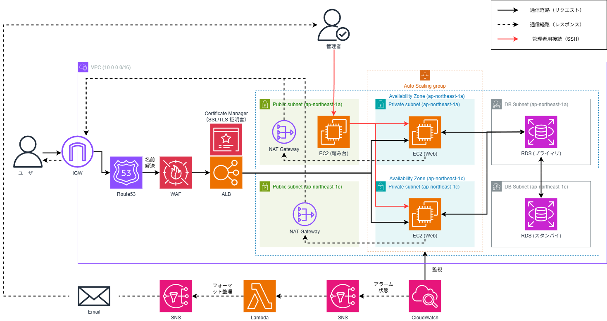

## 概要

本リポジトリは、AWSを用いた高可用性・セキュリティを意識したWebアプリケーション基盤の構築を目的としています。<br>
すべてのリソースはTerraformによってコードで管理しています。

### 高可用性
東京リージョンの2つのアベイラビリティゾーン（ap-northeast-1a・ap-northeast-1c）にWebサーバー（EC2）を分散配置し、<br>
片方のAZが障害を起こした場合でも継続してサービスを提供できる構成を採用しています。<br>
RDSについても同様にマルチAZ構成とし、プライマリ・スタンバイ間の自動フェイルオーバーに対応しています。<br>
またWebサーバーはAuto Scaling Groupとして運用しており、負荷に応じてインスタンス数を自動で増減させることができます。

### セキュリティ
HTTPS通信を採用するとともに、ALBの前段にWAF（Web Application Firewall）を設置することで、<br>
SQLインジェクションなどの攻撃に対する防御を実装しています。

### 運用監視
CloudWatchによるメトリクス監視を構築しており、CPU使用率が閾値を超えた際にはアラームを発報し、<br>
Lambda関数で日本語に整形したアラート通知をメールで受け取れる仕組みを実装しています。

## アーキテクチャ図



## 使用技術・サービス一覧

### AWS サービス
| サービス | 用途 |
|---|---|
| EC2 | Webサーバー・踏み台サーバー |
| ALB | ロードバランサー・マルチAZ対応 |
| Auto Scaling Group | EC2の自動スケーリング |
| RDS (MySQL 8.0) | データベース・マルチAZ構成 |
| WAF | Webアプリケーションファイアウォール |
| ACM | SSL/TLS証明書の発行・管理 |
| Route 53 | DNSレコード管理・ドメイン設定 |
| CloudWatch | メトリクス監視・アラーム設定 |
| SNS | アラート通知の配信 |
| Lambda | アラートメッセージの日本語整形 |
| VPC | ネットワーク構成 |
| NAT Gateway | プライベートサブネットのインターネット接続 |
| IAM | 権限管理 |

### IaC
| ツール | 用途 |
|---|---|
| Terraform | 全AWSリソースのコード管理 |

### 言語・ランタイム
| 言語 | 用途 |
|---|---|
| PHP | Webアプリケーション |
| Node.js (v20) | Lambda関数 |
| Bash | EC2起動時のユーザーデータスクリプト |

## 構成の説明

### VPC・サブネット構成
VPC（10.0.0.0/16）内に、パブリックサブネット・プライベートサブネット・DBサブネットをそれぞれ2つずつ（ap-northeast-1a・ap-northeast-1c）作成しています。<br>
マルチAZ構成により高可用性を維持するとともに、Webサーバーをプライベートサブネットに配置することで、<br>
外部からの直接アクセスを遮断し、必ずALBを経由する構成としています。

### Route 53 / ACM
Route 53で独自ドメインを取得・管理しており、ブラウザからドメインを入力するとRoute 53のホストゾーンで名前解決が行われ、ALBへリクエストが転送される仕組みになっています。<br>
またACMで発行したSSL/TLS証明書をALBにアタッチし、HTTPS通信を実現しています。<br>
HTTPでアクセスした場合は自動的にHTTPSへリダイレクトされます。

### ALB（Application Load Balancer）
マルチAZ構成を採用し、2つのAZに配置されたWebサーバーへのトラフィックを負荷分散しています。<br>
WAFをアタッチすることで、ALBに到達するリクエストに対してアプリケーション層のセキュリティチェックを行っています。

### Auto Scaling Group
高可用性を維持する目的で導入しています。<br>
以下の設定でインスタンス数を自動的に増減させます。

| 項目 | 値 |
|---|---|
| 最小インスタンス数 | 1 |
| 希望インスタンス数 | 2 |
| 最大インスタンス数 | 5 |

### RDS（MySQL 8.0）
マルチAZ構成を採用し、プライマリとスタンバイの2つのインスタンスを異なるAZに配置しています。<br>
通常はプライマリインスタンスとのみ通信を行い、プライマリのAZがダウンした場合にはスタンバイが自動的にプライマリへ昇格（フェイルオーバー）し、処理を継続できる構成としています。

### WAF（Web Application Firewall）
アプリケーション層（L7）のファイアウォールとしてALBにアタッチしています。<br>
以下の2つのルールを設定しています。

| ルール | 内容 |
|---|---|
| AWSマネージドルール | SQLインジェクション・XSSなどの一般的な攻撃を自動検知・遮断 |
| レートベースルール | 同一IPから5分間に2000リクエスト以上の場合にブロック |

### CloudWatch / SNS / Lambda
CloudWatchでAuto Scalingグループ内のEC2インスタンスのCPU使用率を監視しています。<br>
5分間の平均CPU使用率が80%以上になるとアラームを発報し、以下の流れで管理者へ通知を行います。

```
CloudWatch → SNS（トリガー） → Lambda（日本語に整形） → SNS（メール送信） → 管理者メール
```

## 実装のポイント

### HTTPS通信の導入
当初はHTTP通信でALBに接続し、WAFを設置する構成を想定していました。<br>
しかし実務においてHTTPS通信によるセキュアな接続が標準となっているため、<br>
Route 53による独自ドメインの設定とACM（AWS Certificate Manager）によるSSL/TLS証明書の発行を追加し、<br>
HTTPS通信を実現しました。これにより、通信の暗号化とWAFによるアプリケーション層の防御を組み合わせた、<br>
よりセキュアな構成を実現しています。

### Lambdaを活用したアラート通知の改善
CloudWatchのアラームをSNSで直接メール通知する構成では、<br>
通知内容が英語かつ情報量が多く、管理者が状況を即座に把握しにくいという課題がありました。<br>
そこでSNSとメール送信の間にLambda関数を挟み、アラーム情報を日本語に整形した上で送信する構成に改善しました。<br>
これにより、アラーム名・現在の状態・発生時刻・詳細を見やすい形式で受け取ることができるようになりました。

## 学んだこと・苦労した点

### 学んだこと

#### WAF（Web Application Firewall）
今回初めてWAFを実装しました。<br>
これまではHTTPS通信やセキュリティグループによるセキュリティ対策を行っていましたが、<br>
WAFを導入することでアプリケーション層においてSQLインジェクションなどの攻撃を防ぐことができると学びました。<br>
セキュアな構成を実現するためにはファイアウォールが重要であることを改めて認識しました。

#### CloudWatch / SNS
今回初めてCloudWatchとSNSを実装しました。<br>
メトリクスの監視からアラームの発報、通知の送信までを一連の流れで構築することで、<br>
実際の運用現場で必要とされる監視・通知の仕組みについて理解を深めることができました。

### 苦労した点

#### CloudWatchのディメンション未設定
`dimensions`を指定していなかったためCloudWatchが「データ不足」状態から変化しませんでした。<br>
Auto Scalingグループ名を`dimensions`に指定することで解決しました。

**修正前**
```hcl
resource "aws_cloudwatch_metric_alarm" "my_cloudwatch" {
  metric_name = "CPUUtilization"
  namespace   = "AWS/EC2"
  # dimensionsの指定なし
}
```

**修正後**
```hcl
resource "aws_cloudwatch_metric_alarm" "my_cloudwatch" {
  metric_name = "CPUUtilization"
  namespace   = "AWS/EC2"
  dimensions = {
    AutoScalingGroupName = aws_autoscaling_group.main.name
  }
}
```

#### SNSサブスクリプションの未承認
メール通知が届かない原因として、確認メールの「Confirm subscription」リンクをクリックする必要があることに気づくまで時間がかかりました。<br>
`terraform apply`後にAWSから送信される確認メールを承認することで解決しました。

**修正前（未承認の状態）**

```ステータス：保留中の確認```

**修正後（承認後の状態）**

```ステータス：確認済み```

#### Terraformの`source_code_hash`
Lambda関数の設定で`code_sha256`を指定したところ、読み取り専用の属性であるためエラーが発生しました。<br>
正しくは`source_code_hash`を使用することで解決しました。

**修正前**
```hcl
resource "aws_lambda_function" "to_sns_function" {
  filename     = data.archive_file.to_zip.output_path
  code_sha256  = data.archive_file.to_zip.output_base64sha256
}
```

**修正後**
```hcl
resource "aws_lambda_function" "to_sns_function" {
  filename         = data.archive_file.to_zip.output_path
  source_code_hash = data.archive_file.to_zip.output_base64sha256
}
```

#### CloudWatchアラームのテスト
`stress`コマンドで1台のEC2にのみ負荷をかけたところ、<br>
ASG全体の平均CPU使用率が閾値に達しませんでした。<br>
Auto Scalingグループの監視では全インスタンスの平均値が使われるため、<br>
2台両方に負荷をかける必要があることを学びました。

**修正前（1台のみ）**
```bash
# 1台目のEC2のみで実行
stress --cpu $(nproc) --timeout 300
```

**修正後（2台同時）**
```bash
# 1台目のEC2で実行
stress --cpu $(nproc) --timeout 300

# 2台目のEC2でも同時に実行
stress --cpu $(nproc) --timeout 300
```